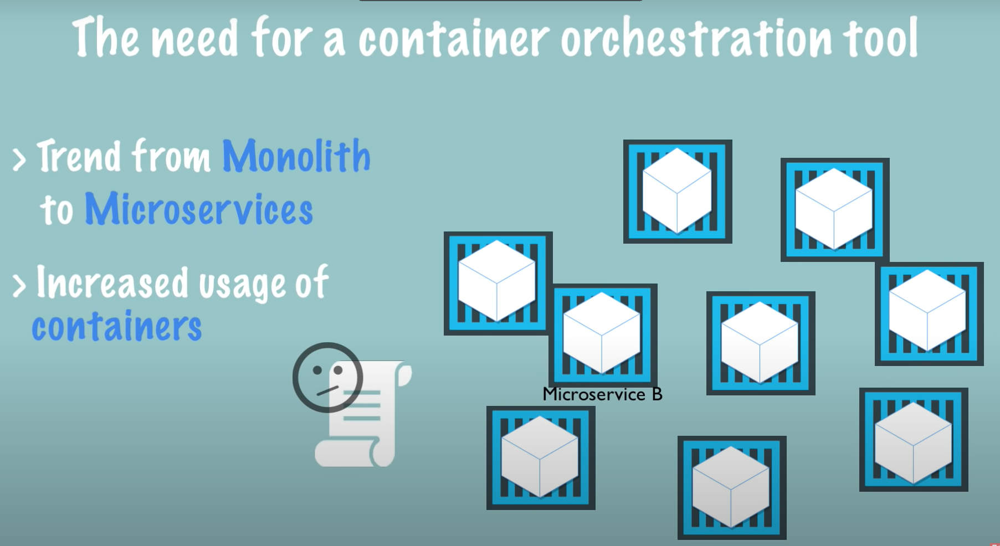

# Introduction

Kubernetes is an open source container orchestration tool developed by Google.

On the foundation, it manages container’s speed such as Docker containers. Which basically means Kubernetes helps you manage application that made up 100 or 1000 containers and it helps you manage them in different environments like physical machines, virtual machines or cloud environments.

#### What problems does Kubernetes solve?

<figure><figcaption></figcaption></figure>

Kubernetes solves the problem of managing large numbers of containers, which arose from the increasing adoption of microservices and container technologies. As containers became the ideal host for small, independent applications like microservices, applications began to consist of hundreds or even thousands of containers. However, managing these containers across multiple environments using scripts and homemade tools became increasingly complex and often impossible. This led to the need for container orchestration technologies like Kubernetes, which simplifies and automates the management of containerized applications.

#### What are the tasks of an orchestration tool?

So, what orchestration tools like Kubernetes do is guarantee the following features:

1. High availability, which means the application has no downtime and is always accessible to users.
2. Scalability, which means the application has high performance, loads fast, and provides high response rates to users.
3. Disaster recovery, which means that if the infrastructure experiences problems like data loss or server failure, the mechanism can restore the data to its latest state, ensuring the application doesn't lose any data. The containerized application can then continue running from the latest state after recovery.

All these functionalities are offered by container orchestration technologies like Kubernetes.
